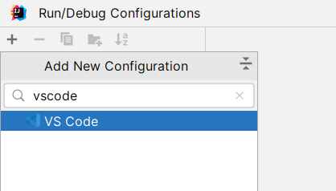
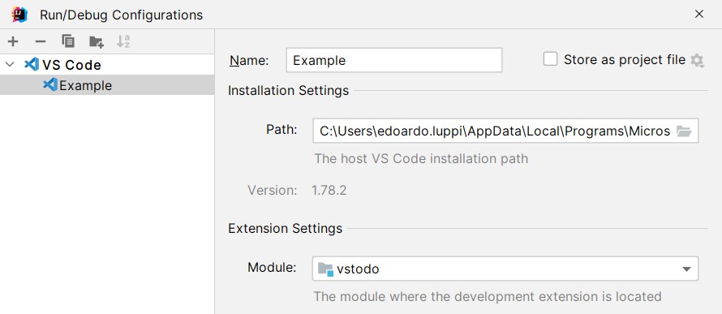

# VS Code Development Support

Provides a Run/Debug Configuration to easily test your VS Code extension inside of IntelliJ IDEA.

## Current limitations

- Uses remote debugging, which is slower than native VS Code debugging
- Debugger does not work immediately after invoking _Reload Window_
- Cannot debug tests
- _Before launch_ tasks are blocking, so we cannot use `npm watch` (never terminates).  
  I'll have to think how to work around this.

## Requirements

The plugin needs JavaScript and NodeJS support, and because of that IntelliJ IDEA Community is not supported.

## Instructions

- Create a VS Code Run Configuration

  

- Select the path of your local VS Code installation, and the IDE module containing the extension

  
