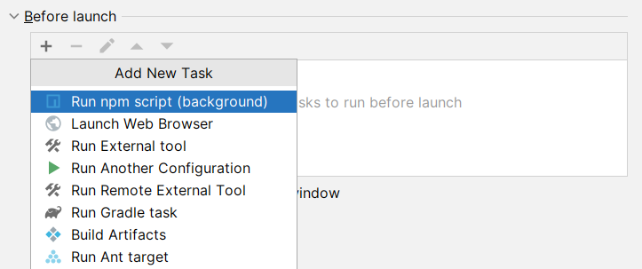

# VS Code Development Support

Provides a Run/Debug Configuration to easily test your VS Code extension inside of IntelliJ IDEA.

## Current limitations

- Uses remote debugging, which is slower than native VS Code debugging
- Debugger does not work immediately after invoking _Reload Window_
- Cannot debug tests
- _Before launch_ tasks are blocking, so we cannot use `npm watch` (never terminates).  
  I'll have to think how to work around this.

See also: https://youtrack.jetbrains.com/issue/WEB-61430

## Requirements

The plugin needs JavaScript and NodeJS support, and because of that IntelliJ IDEA Community is not supported.

## Instructions

1. Create a VS Code Run Configuration

   

2. Select the path of your local VS Code installation, and the project's module containing the extension

   

3. Optionally configure _Before launch_ tasks.  
   It is important to select _background_ tasks (plugin specific), which do not block the Run Configuration execution.

   
